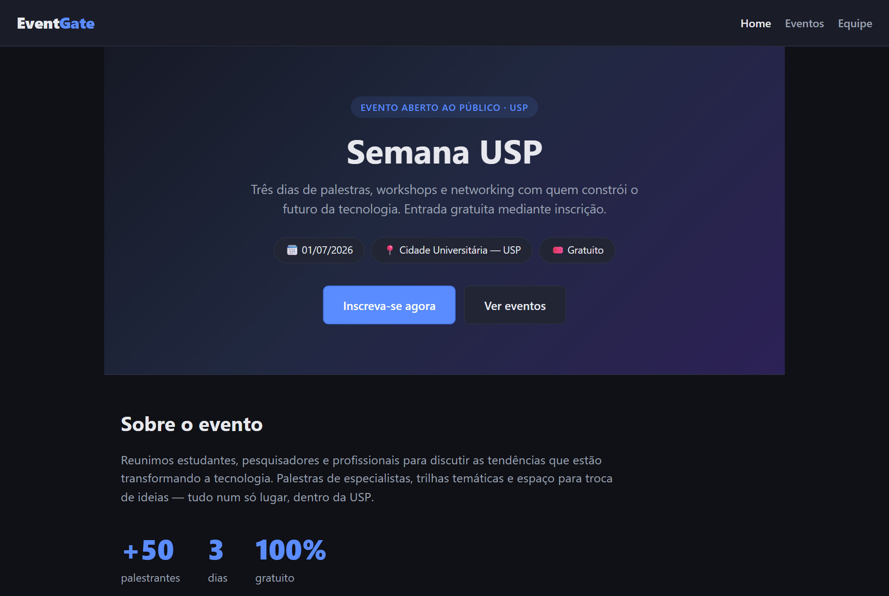
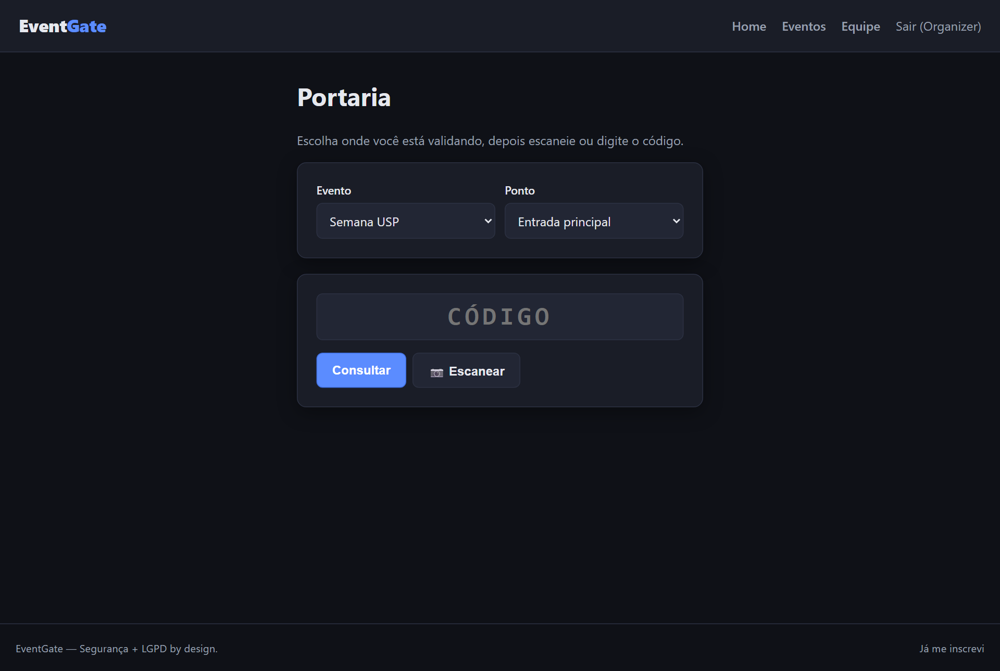
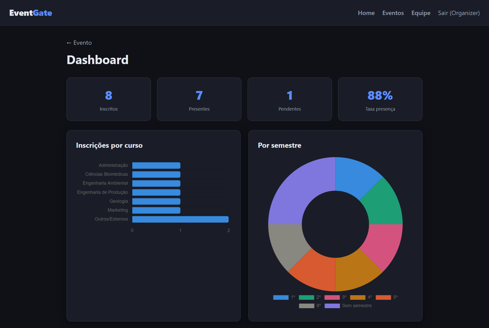

# EventGate


**Plataforma de inscrição e validação de presença em eventos** — com geração de
**código de acesso + QR Code**, **leitura na portaria** (entrada principal e por
palestra), **dashboard** para a equipe e **conformidade com a LGPD**.

> Fluxo: a pessoa se inscreve → recebe um código único e um QR por e-mail → na
> portaria a equipe lê o QR, confere a **foto** e confirma a entrada (sem reuso) →
> em cada palestra, marca presença. A equipe acompanha tudo num painel com gráficos.

---

## Capturas de tela

<!-- Adicione seus prints em docs/screenshots/ e remova os comentários abaixo -->
<!--  -->
<!--  -->
<!--  -->

_Landing do evento • Portaria (leitura do QR com foto) • Dashboard da equipe._

---

## Funcionalidades

**Participante (público, sem login)**
- Landing page de divulgação (palestrantes e programação).
- Inscrição com nome, e-mail, **foto**, nascimento e **curso** (lista USP ou "Outro").
- Recebe **código + QR Code** (na tela e por e-mail).
- **LGPD**: consulta e exclusão dos próprios dados (código + e-mail).

**Equipe (login, RBAC)**
- **Portaria**: leitura do QR/código com **foto** para conferência, confirma a
  entrada (impede reuso) e **marca presença por palestra**.
- **Dashboard**: presença total, por curso, por semestre e por palestra (gráficos).
- Gestão: eventos, cursos, palestrantes, palestras, inscritos e contas da equipe.

**Segurança & LGPD**
- Senhas com **PBKDF2-HMAC-SHA256** + salt (comparação em tempo constante).
- **JWT** + autorização por perfil (Organizer / Validator) e menor privilégio.
- Código de acesso com RNG criptográfico + unicidade em duas camadas.
- Rate limiting, cabeçalhos de segurança, erros sem vazar detalhes.
- Consentimento registrado, minimização de dados, PII fora da URL, auditoria.

---

## Stack

| Camada | Tecnologia |
|---|---|
| Back-end | ASP.NET Core 10 (Web API) · C# 14 |
| Banco | SQL Server + Entity Framework Core 10 (SQLite no modo dev) |
| Auth | JWT (Bearer) + RBAC |
| QR / E-mail | QRCoder · Brevo (API) |
| Front-end | React 18 + TypeScript + Vite + React Router |
| Front extras | `@zxing/browser` (leitor de QR) · `react-chartjs-2` |
| Testes | xUnit + Moq + WebApplicationFactory (integração) |
| Infra / CI | Docker + Docker Compose · GitHub Actions |
| Docs | Swagger / OpenAPI |

---

## Arquitetura

Clean Architecture em camadas, dependendo de **abstrações** (testável com mocks):

```
src/EventGate.Api/
├── Domain/         # Entidades e enums
├── Application/    # Casos de uso, DTOs, interfaces
├── Infrastructure/ # EF, repositórios, segurança, QR, e-mail, seed
└── Api/            # Controllers + middleware
web/                # Front-end React + TypeScript
tests/              # Testes unitários e de integração
```

Detalhes completos em **[PLANO.md](PLANO.md)**.

---

## Início rápido

### Modo dev — sem instalar banco (SQLite)

```bash
# back-end (cria o schema e os dados de exemplo automaticamente)
$env:Database__Provider="Sqlite"
$env:ConnectionStrings__Default="Data Source=eventgate-dev.db"
dotnet run --project src/EventGate.Api

# front-end (noutro terminal)
cd web && npm install && npm run dev   # http://localhost:5173
```

### Docker Compose (API + SQL Server)

```bash
docker compose up --build
```

**Primeiro login (organizador seed):** `admin@eventgate.local` / `Admin@123`.

Guia de produção (SQL Server, HTTPS, Brevo, segredos): **[DEPLOY.md](DEPLOY.md)**.

---

## Documentação da API

- **Swagger / OpenAPI** interativo em `/swagger` (modo Development) — com botão
  **Authorize** para testar endpoints autenticados.

Principais endpoints:

| Método | Rota | Acesso |
|---|---|---|
| POST | `/api/auth/login` | Público |
| POST | `/api/auth/register-staff` | Organizer |
| GET | `/api/events` · `/api/courses` · `/api/events/{id}/speakers` · `/sessions` | Público |
| POST | `/api/events/{id}/registrations` (multipart) | Público |
| POST · DELETE | `/api/registrations/me` | Público (LGPD) |
| GET | `/api/checkin/lookup` | Equipe |
| POST | `/api/checkin/validate` | Equipe |
| POST | `/api/checkin/sessions/{id}/attend` | Equipe |
| GET | `/api/dashboard/events/{id}/by-course \| by-semester \| by-session` | Equipe |
| GET | `/health` | Público |

---

## Testes

```bash
dotnet test
```

47 testes: regras de negócio (unitários com Moq) + **integração** que sobe a API
real (WebApplicationFactory + SQLite) e exercita o fluxo inscrição → portaria → presença.

---

## Roadmap

- Envio do código por e-mail em produção (Brevo) e geração de relatórios.
- Criptografia de PII em repouso e job de anonimização/retenção (LGPD).
- Deploy na Azure (App Service + Azure SQL).

---

## Licença

[MIT](LICENSE) © 2026 Davi Marinho
